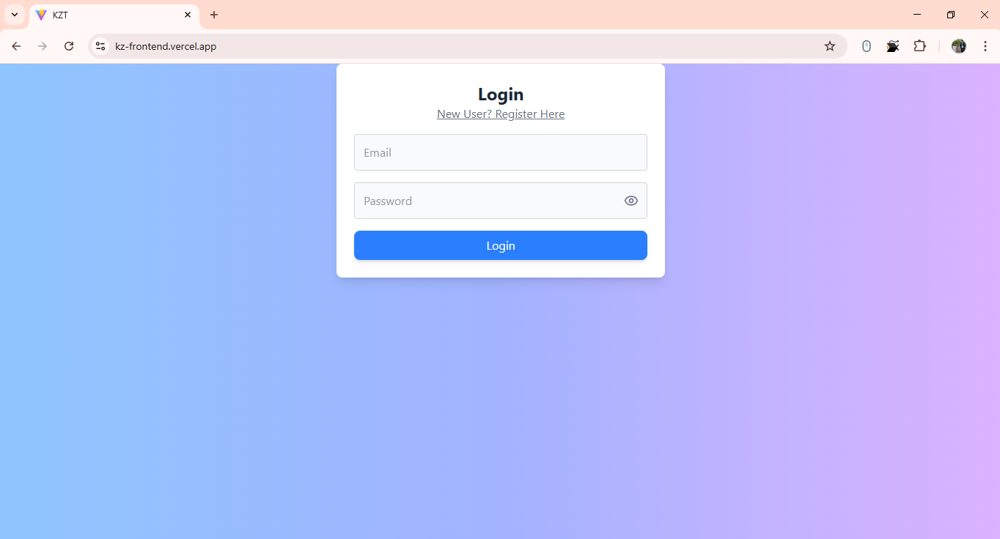
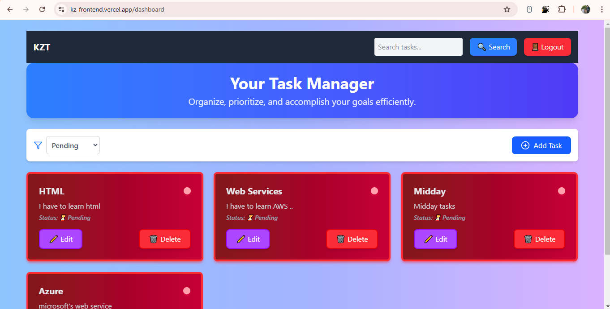
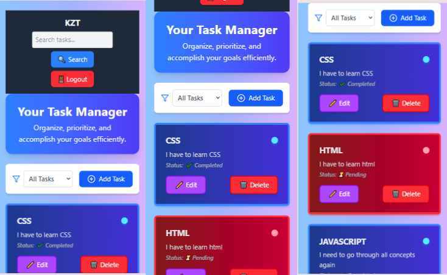

# 🚀 KZ Frontend

Welcome to the **KZ Frontend Repository**! This project serves as the user interface for the KZ task management application.

## 🌟 Features
- User authentication (Register & Login)
- Task creation, updating, and deletion
- Fully responsive UI
- Modern design with smooth user experience

## 📥 Clone the Repository
```bash
git clone https://github.com/Sandykr29/kz_frontend.git
cd kz_frontend
```

## 📦 Install Dependencies
```bash
npm install
```

## 🔧 Environment Variables
Create a `.env` file in the root directory and add:
```env
VITE_API_URL=https://kz-w1l6.onrender.com
```

## 🚀 Run the Application
```bash
npm run dev
```

## 📌 API Endpoints
This frontend interacts with the backend API. Check out the full API documentation in the backend repository:
[Backend Repository](https://github.com/Sandykr29/KZ.git)

## 🔗 Deployment
- **Frontend:** [Live Here](https://kz-frontend.vercel.app/)
- **Backend:** [Live Here](https://kz-w1l6.onrender.com)


## 📸 Screenshots

### Login Page  


### Registration Page  


### Dashboard  


### Edit Task  


### filter Task



### Search for related text  


### Mobile View  



## 👨‍💻 Developer
👤 **Sandeep Kumar**  
GitHub: [@Sandykr29](https://github.com/Sandykr29)
